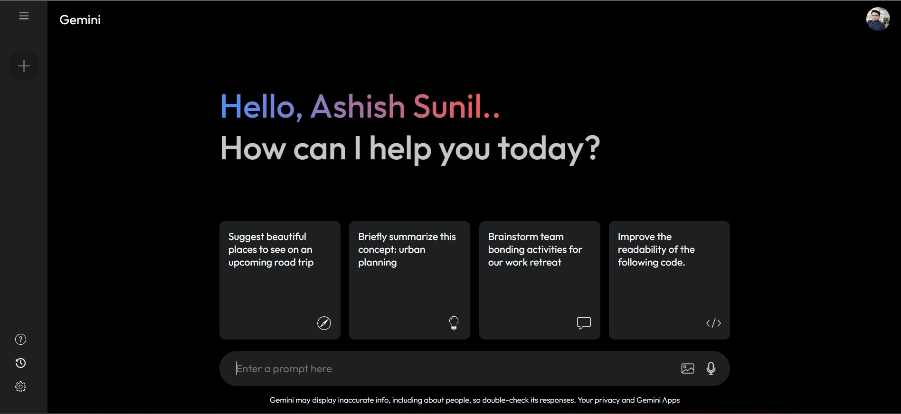

## Gemini-Clone AI 🎯

</ul><h2> Preview ⚡️</h2>
<p align="center">
  
</p>

## Features 🔥

✔️ Generated a Generative AI App using Google Gemini API with React JS <br />

## Technologies used 🛠️

**Markup**: HTML <br />
**Design**: Css<br />
**Language**: JavaScript <br />
**Framework**: React JS <br />
**API**: Google Gemini API <br />

## Usage 📋

<details open>
<summary> Here it is used to perform the generative AI used in Google gemini API and implemented using React Js Framework </summary>

```bash
#1. clone this project
~ git clone https://github.com/ashishthomas/Gemini-Clone-App.git

#2. Open the App.jsx file in your browser
~ open App.Jsx

#3. Select the path to open the project folder
~ open App.Jsx

#4. To display the generative Ai Gemini-Clone
~ npm run dev

#5. Rendering the Live Server in the localhost
~ http://localhost:5173/

#4. Enjoy!

```

</details>

## Disclamer ❗️

I am simply an Employee passionate about Front-end and the intersection of code and design, I always try to do courses and projects during my free time, so I can learn more and more. I am always open to suggestions and feedback.

## Contributing 💡

Pull request are welcome but please open an issue and discuss what you will do before 😊

## Author ✒️

**Ashish Sunil Thomas**

## Like this project? 💖

Give a ⭐️ if you like this project!

# React + Vite

This template provides a minimal setup to get React working in Vite with HMR and some ESLint rules.

Currently, two official plugins are available:

- [@vitejs/plugin-react](https://github.com/vitejs/vite-plugin-react/blob/main/packages/plugin-react/README.md) uses [Babel](https://babeljs.io/) for Fast Refresh
- [@vitejs/plugin-react-swc](https://github.com/vitejs/vite-plugin-react-swc) uses [SWC](https://swc.rs/) for Fast Refresh
